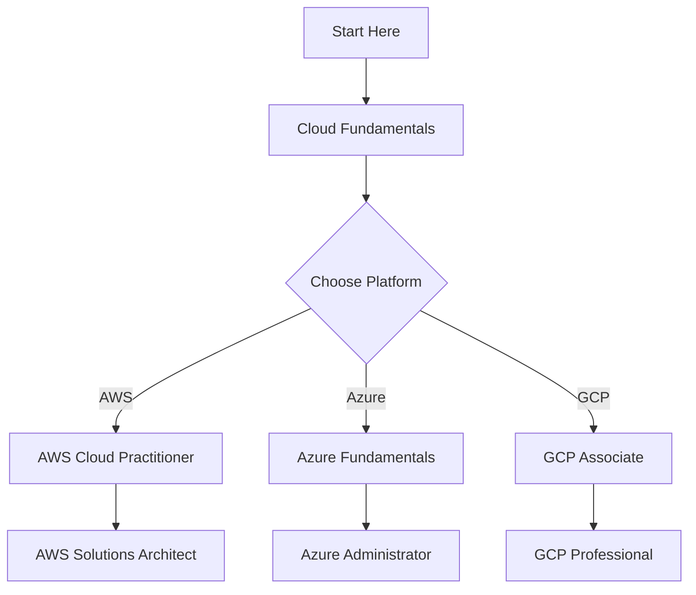

# ☁️ Cloud Computing for Beginners ☁️

<div align="center">
  
  
  
  
  
  [](https://github.com/username/repo/stargazers)
  [](https://github.com/username/repo/network)
  [](https://github.com/username/repo/issues)
  [](LICENSE)

</div>

---

## 🚀 What is Cloud Computing?


Cloud computing is the delivery of computing services—including servers, storage, databases, networking, software, analytics, and intelligence—over the Internet ("the cloud") to offer faster innovation, flexible resources, and economies of scale.

### 🌟 Key Benefits:
- **💰 Cost Effective**: Pay only for what you use
- **🔧 Scalable**: Scale up or down as needed  
- **🌍 Global Access**: Access from anywhere
- **🔒 Secure**: Enterprise-level security
- **⚡ Fast**: Quick deployment and updates

---

## 📚 Learning Path

<div align="center">
  
</div>

### 🎯 Beginner Level

<details>
<summary>📖 Click to expand Fundamentals</summary>

#### Week 1-2: Cloud Basics
- [ ] What is Cloud Computing?
- [ ] Cloud Service Models (IaaS, PaaS, SaaS)
- [ ] Cloud Deployment Models
- [ ] Major Cloud Providers Overview

#### Week 3-4: Getting Started
- [ ] Create AWS/Azure/GCP Free Account
- [ ] Navigate Cloud Console
- [ ] Basic Terminology
- [ ] Security Fundamentals

</details>

### 🚀 Intermediate Level

<details>
<summary>🔧 Click to expand Intermediate Topics</summary>

#### Month 2: Core Services
- [ ] Virtual Machines & Containers
- [ ] Storage Solutions
- [ ] Networking Basics
- [ ] Databases in the Cloud
- [ ] Identity & Access Management

#### Month 3: DevOps & Automation
- [ ] Infrastructure as Code
- [ ] CI/CD Pipelines
- [ ] Monitoring & Logging
- [ ] Auto-scaling

</details>

### 🏆 Advanced Level

<details>
<summary>⚡ Click to expand Advanced Concepts</summary>

#### Month 4+: Architecture & Best Practices
- [ ] Microservices Architecture
- [ ] Serverless Computing
- [ ] Multi-cloud Strategies
- [ ] Cost Optimization
- [ ] Security Best Practices
- [ ] Disaster Recovery

</details>

---

## 🛠️ Popular Cloud Platforms

<div align="center">

| Platform | Logo | Strengths | Best For |
|----------|------|-----------|----------|
| **Amazon Web Services (AWS)** |  | Market Leader, Comprehensive | Enterprise, Startups |
| **Microsoft Azure** |  | Microsoft Integration | Windows Environments |
| **Google Cloud Platform** |  | AI/ML, Analytics | Data Science, AI |

</div>

---

## 🎮 Interactive Learning Resources

<div align="center">
  
</div>

### 📖 Free Learning Materials

- 🎓 **AWS Cloud Practitioner Essentials** - Free AWS course
- 🎯 **Microsoft Learn** - Interactive learning paths
- 📚 **Google Cloud Skills Boost** - Hands-on labs
- 🎪 **Cloud Academy** - Video tutorials and labs
- 📖 **A Cloud Guru** - Comprehensive courses

### 🏆 Certifications to Pursue



---

## 🔥 Hands-On Projects


### 🚀 Beginner Projects

1. **Static Website Hosting**
   - Deploy a simple website using cloud storage
   - Configure domain and SSL

2. **Database Setup**
   - Create and configure a cloud database
   - Connect from a web application

3. **File Storage System**
   - Build a file upload/download system
   - Implement user authentication

### 🔧 Intermediate Projects

4. **Auto-Scaling Web App**
   - Deploy containerized application
   - Configure load balancing and auto-scaling

5. **Data Pipeline**
   - Process and analyze data in the cloud
   - Set up automated workflows

6. **Monitoring Dashboard**
   - Create custom metrics and alerts
   - Build visualization dashboards

---

## 📊 Cloud Computing Statistics

<div align="center">
  
  
  
  

</div>

### 📈 Industry Growth
- Cloud market size: **$500+ billion** by 2025
- Job growth: **25%** annually for cloud roles
- Companies using cloud: **90%** of enterprises

---

## 🤝 Community & Support

<div align="center">
  
</div>

### 💬 Join Our Community

- 💬 **Discord**: [Join our Cloud Learners community](https://discord.gg/cloudlearners)
- 📱 **Reddit**: [r/cloudcomputing](https://reddit.com/r/cloudcomputing)
- 🐦 **Twitter**: Follow [@CloudLearning](https://twitter.com/cloudlearning)
- 💼 **LinkedIn**: [Cloud Computing Group](https://linkedin.com/groups)

### 🆘 Get Help

- 🐛 **Issues**: Report bugs or ask questions in [Issues](https://github.com/username/repo/issues)
- 💡 **Discussions**: Join conversations in [Discussions](https://github.com/username/repo/discussions)
- 📧 **Email**: contact@cloudlearning.com

---

## 🎯 Quick Start Guide

<details>
<summary>⚡ Click for 5-Minute Setup</summary>

### Step 1: Choose Your Platform
```bash
# AWS CLI Installation
curl "https://awscli.amazonaws.com/awscli-exe-linux-x86_64.zip" -o "awscliv2.zip"
unzip awscliv2.zip
sudo ./aws/install
```

### Step 2: Configure Credentials
```bash
aws configure
# Enter your Access Key ID, Secret Access Key, and Region
```

### Step 3: Your First Cloud Resource
```bash
# Create an S3 bucket
aws s3 mb s3://my-first-cloud-bucket-unique-name
```

### Step 4: Verify Setup
```bash
# List your buckets
aws s3 ls
```

🎉 **Congratulations!** You've created your first cloud resource!

</details>

---

## 📅 Learning Schedule Template

<div align="center">
  
</div>

| Week | Focus Area | Hours/Week | Milestone |
|------|------------|------------|-----------|
| 1-2 | Cloud Fundamentals | 5-7 hours | Complete basics quiz |
| 3-4 | Platform Exploration | 6-8 hours | Create first resource |
| 5-8 | Hands-on Practice | 8-10 hours | Deploy first project |
| 9-12 | Certification Prep | 10-12 hours | Pass practice exams |

---

## 🏅 Achievements System

<div align="center">

### 🌟 Collect Your Badges!

| Badge | Description | How to Earn |
|-------|-------------|-------------|
| 🎯 **Cloud Rookie** | Complete fundamentals | Finish Week 1-2 content |
| ⚡ **Resource Creator** | First cloud resource | Deploy any cloud service |
| 🚀 **Project Builder** | Complete first project | Build and deploy an app |
| 🏆 **Certified Professional** | Get certified | Pass any cloud certification |
| 👨‍🏫 **Community Helper** | Help others learn | Answer 5 questions in discussions |

</div>

---

## 🔗 Useful Links & Tools


### 🛠️ Essential Tools

- **Cloud CLI Tools**: AWS CLI, Azure CLI, gcloud
- **Infrastructure as Code**: Terraform, CloudFormation
- **Monitoring**: CloudWatch, Azure Monitor, Stackdriver
- **Version Control**: Git, GitHub, GitLab
- **Containers**: Docker, Kubernetes

### 📚 Documentation

- [AWS Documentation](https://docs.aws.amazon.com/)
- [Azure Documentation](https://docs.microsoft.com/azure/)
- [Google Cloud Documentation](https://cloud.google.com/docs)

---

## 🎊 Success Stories

<div align="center">
  
</div>

> *"Started as a complete beginner 6 months ago. Now I'm a certified AWS Solutions Architect and landed my dream job!"* 
> 
> **- Sarah M., Software Engineer**

> *"The hands-on projects really helped me understand cloud concepts. Highly recommend this learning path!"*
> 
> **- Mike T., DevOps Engineer**

---

## 📞 Contact & Feedback

<div align="center">

[](mailto:contact@cloudlearning.com)
[](https://linkedin.com/in/cloudlearning)
[](https://twitter.com/cloudlearning)

</div>

---

## 📜 License

This project is licensed under the MIT License - see the [LICENSE](LICENSE) file for details.

---

<div align="center">
  
  
  
  
  
  **⭐ Don't forget to star this repository if it helped you! ⭐**
  
  

</div>

---

<div align="center">
  <sub>Built with ❤️ for the cloud community</sub>
</div>
